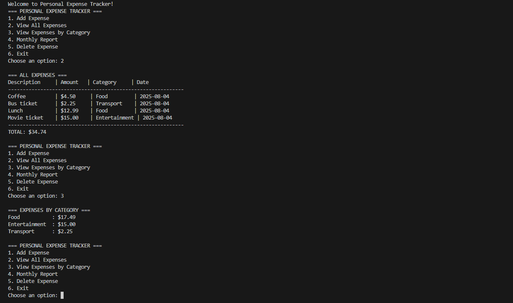

# Repository Structure

```
personal-expense-tracker/
├── README.md
├── LICENSE
├── .gitignore
├── CONTRIBUTING.md
├── CHANGELOG.md
├── src/
│   ├── main/
│   │   └── java/
│   │       └── com/
│   │           └── expensetracker/
│   │               ├── Main.java
│   │               ├── ExpenseTracker.java
│   │               └── model/
│   │                   └── Expense.java
│   └── test/
│       └── java/
│           └── com/
│               └── expensetracker/
│                   └── ExpenseTrackerTest.java
├── docs/
│   ├── screenshots/
│   │   └── demo.png
│   └── API.md
├── examples/
│   └── sample-expenses.txt
└── scripts/
    ├── build.sh
    └── run.sh
```

---

# Personal Expense Tracker 💰

[](https://www.oracle.com/java/)
[](https://opensource.org/licenses/MIT)
[]()



A simple, intuitive Java console application for tracking personal expenses. Perfect for students learning Java or anyone who wants a lightweight expense tracking solution.

## ✨ Features

- 📝 **Add Expenses** - Record expenses with description, amount, and category
- 📊 **View All Expenses** - Display comprehensive expense list with totals
- 🏷️ **Category Analysis** - Group and analyze spending by categories
- 📅 **Monthly Reports** - Get insights into your monthly spending patterns
- 🗑️ **Delete Expenses** - Remove unwanted expense entries
- 💾 **Sample Data** - Pre-loaded examples to explore features immediately

## 🚀 Quick Start

### Prerequisites
- Java 11 or higher
- Git (for cloning)

### Installation

1. **Clone the repository**
   ```bash
   git clone https://github.com/yourusername/personal-expense-tracker.git
   cd personal-expense-tracker
   ```

2. **Compile the project**
   ```bash
   javac -d out src/main/java/com/expensetracker/*.java src/main/java/com/expensetracker/model/*.java
   ```

3. **Run the application**
   ```bash
   java -cp out com.expensetracker.Main
   ```

   Or use the provided scripts:
   ```bash
   chmod +x scripts/build.sh scripts/run.sh
   ./scripts/build.sh
   ./scripts/run.sh
   ```

## 📖 Usage

### Main Menu Options

```
=== PERSONAL EXPENSE TRACKER ===
1. Add Expense
2. View All Expenses
3. View Expenses by Category
4. Monthly Report
5. Delete Expense
6. Exit
```

### Example Usage

**Adding an Expense:**
```
Enter expense description: Coffee at Starbucks
Enter amount: $4.50
Enter category: Food
✓ Expense added successfully!
```

**Viewing Expenses:**
```
=== ALL EXPENSES ===
Description     | Amount   | Category     | Date
------------------------------------------------------------
Coffee          | $4.50    | Food         | 2025-08-04
Bus ticket      | $2.25    | Transport    | 2025-08-04
Lunch           | $12.99   | Food         | 2025-08-04
Movie ticket    | $15.00   | Entertainment| 2025-08-04
------------------------------------------------------------
TOTAL: $34.74
```

## 🏗️ Project Structure

```
src/
├── main/java/com/expensetracker/
│   ├── Main.java                 # Application entry point
│   ├── ExpenseTracker.java       # Main application logic
│   └── model/
│       └── Expense.java          # Expense data model
└── test/java/com/expensetracker/
    └── ExpenseTrackerTest.java   # Unit tests
```

## 🛠️ Technical Details

### Core Technologies
- **Java 11+** - Core programming language
- **Collections Framework** - ArrayList, HashMap for data management
- **Java 8 Streams** - Functional programming for data processing
- **LocalDate API** - Modern date/time handling
- **Scanner** - Console input handling

### Key Java Concepts Demonstrated
- Object-Oriented Programming (OOP)
- Encapsulation with getter/setter methods
- Collections and data structures
- Lambda expressions and method references
- Stream API for data processing
- Exception handling
- String formatting and I/O operations

## 🧪 Testing

Run the unit tests:
```bash
javac -cp .:junit-5.jar src/test/java/com/expensetracker/ExpenseTrackerTest.java
java -cp .:junit-5.jar:hamcrest.jar org.junit.runner.JUnitCore ExpenseTrackerTest
```

## 🤝 Contributing

Contributions are welcome! Please feel free to submit a Pull Request. For major changes, please open an issue first to discuss what you would like to change.

See [CONTRIBUTING.md](CONTRIBUTING.md) for detailed guidelines.

### Development Setup
1. Fork the repository
2. Create your feature branch (`git checkout -b feature/AmazingFeature`)
3. Commit your changes (`git commit -m 'Add some AmazingFeature'`)
4. Push to the branch (`git push origin feature/AmazingFeature`)
5. Open a Pull Request

## 📝 Roadmap

- [ ] **Data Persistence** - Save expenses to file/database
- [ ] **GUI Version** - JavaFX or Swing interface
- [ ] **Expense Categories** - Custom category management
- [ ] **Budget Limits** - Set and track budget goals
- [ ] **Export Features** - CSV/PDF report generation
- [ ] **Multi-currency Support** - Handle different currencies
- [ ] **Recurring Expenses** - Automatic expense entries

## 📄 License

This project is licensed under the MIT License - see the [LICENSE](LICENSE) file for details.

## 🙏 Acknowledgments

- Inspired by the need for simple personal finance management
- Built as a learning project for Java programming concepts
- Thanks to the Java community for excellent documentation and resources

## 📞 Support

If you have any questions or run into issues, please:
- Check the [Issues](https://github.com/yourusername/personal-expense-tracker/issues) page
- Create a new issue if your problem isn't already reported
- Include detailed information about your environment and the issue

---

**Happy expense tracking! 💰**

---

# LICENSE (MIT License)

```
MIT License

Copyright (c) 2025 Personal Expense Tracker

Permission is hereby granted, free of charge, to any person obtaining a copy
of this software and associated documentation files (the "Software"), to deal
in the Software without restriction, including without limitation the rights
to use, copy, modify, merge, publish, distribute, sublicense, and/or sell
copies of the Software, and to permit persons to whom the Software is
furnished to do so, subject to the following conditions:

The above copyright notice and this permission notice shall be included in all
copies or substantial portions of the Software.

THE SOFTWARE IS PROVIDED "AS IS", WITHOUT WARRANTY OF ANY KIND, EXPRESS OR
IMPLIED, INCLUDING BUT NOT LIMITED TO THE WARRANTIES OF MERCHANTABILITY,
FITNESS FOR A PARTICULAR PURPOSE AND NONINFRINGEMENT. IN NO EVENT SHALL THE
AUTHORS OR COPYRIGHT HOLDERS BE LIABLE FOR ANY CLAIM, DAMAGES OR OTHER
LIABILITY, WHETHER IN AN ACTION OF CONTRACT, TORT OR OTHERWISE, ARISING FROM,
OUT OF OR IN CONNECTION WITH THE SOFTWARE OR THE USE OR OTHER DEALINGS IN THE
SOFTWARE.
```

---

# .gitignore

```
# Compiled class files
*.class

# Log files
*.log

# BlueJ files
*.ctxt

# Mobile Tools for Java (J2ME)
.mtj.tmp/

# Package Files
*.jar
*.war
*.nar
*.ear
*.zip
*.tar.gz
*.rar

# Virtual machine crash logs
hs_err_pid*
replay_pid*

# IDE files
.idea/
.vscode/
*.iml
*.ipr
*.iws

# Eclipse
.classpath
.project
.settings/
bin/

# NetBeans
/nbproject/private/
/nbbuild/
/dist/
/nbdist/
/.nb-gradle/
build/

# Gradle
.gradle/
build/

# Maven
target/
pom.xml.tag
pom.xml.releaseBackup
pom.xml.versionsBackup
pom.xml.next
release.properties
dependency-reduced-pom.xml
buildNumber.properties
.mvn/timing.properties
.mvn/wrapper/maven-wrapper.jar

# OS generated files
.DS_Store
.DS_Store?
._*
.Spotlight-V100
.Trashes
ehthumbs.db
Thumbs.db

# Output directory
out/
```

---

# CONTRIBUTING.md

# Contributing to Personal Expense Tracker

Thank you for considering contributing to Personal Expense Tracker! This document provides guidelines and information for contributors.

## 🤝 How to Contribute

### Reporting Bugs
1. Check if the bug has already been reported in [Issues](https://github.com/yourusername/personal-expense-tracker/issues)
2. If not, create a new issue with:
   - Clear, descriptive title
   - Steps to reproduce the bug
   - Expected vs actual behavior
   - Java version and OS information
   - Any relevant error messages or logs

### Suggesting Features
1. Check existing issues for similar feature requests
2. Create a new issue tagged with "enhancement"
3. Describe the feature and its benefits
4. Provide examples of how it would work

### Code Contributions

#### Setup Development Environment
1. Fork the repository
2. Clone your fork: `git clone https://github.com/yourusername/personal-expense-tracker.git`
3. Create a branch: `git checkout -b feature/your-feature-name`

#### Coding Standards
- Follow Java naming conventions
- Use meaningful variable and method names
- Add comments for complex logic
- Maintain consistent indentation (4 spaces)
- Keep methods focused and concise

#### Before Submitting
- Test your changes thoroughly
- Update documentation if needed
- Make sure your code compiles without warnings
- Follow the existing code style

#### Pull Request Process
1. Update README.md if you've added features
2. Add tests for new functionality
3. Ensure all tests pass
4. Submit pull request with clear description
5. Link any related issues

## 📋 Development Guidelines

### Code Style
- Use camelCase for variables and methods
- Use PascalCase for class names
- Use UPPER_CASE for constants
- Maximum line length: 100 characters

### Testing
- Write unit tests for new features
- Maintain or improve test coverage
- Test edge cases and error conditions

### Documentation
- Update README.md for new features
- Add inline comments for complex logic
- Update CHANGELOG.md for significant changes

## 🏷️ Issue Labels

- `bug` - Something isn't working
- `enhancement` - New feature or request
- `documentation` - Improvements to documentation
- `good first issue` - Good for newcomers
- `help wanted` - Extra attention needed

## 📝 Commit Messages

Use clear, descriptive commit messages:
- `feat: add monthly budget tracking`
- `fix: resolve category filtering bug`
- `docs: update installation instructions`
- `test: add expense deletion tests`

## 🙏 Recognition

Contributors will be acknowledged in:
- README.md contributors section
- Release notes for significant contributions
- Special thanks for first-time contributors

Thank you for helping make Personal Expense Tracker better!

---

# CHANGELOG.md

# Changelog

All notable changes to this project will be documented in this file.

The format is based on [Keep a Changelog](https://keepachangelog.com/en/1.0.0/),
and this project adheres to [Semantic Versioning](https://semver.org/spec/v2.0.0.html).

## [Unreleased]

### Planned
- Data persistence to file
- GUI interface with JavaFX
- Budget tracking and alerts
- Custom category management
- Export to CSV/PDF

## [1.0.0] - 2025-08-04

### Added
- Initial release of Personal Expense Tracker
- Core expense tracking functionality
- Add, view, and delete expenses
- Category-based expense grouping
- Monthly expense reports
- Console-based user interface
- Sample data for demonstration
- Comprehensive documentation
- MIT License
- Unit test framework setup

### Features
- **Expense Management**: Add expenses with description, amount, and category
- **Data Visualization**: View expenses in formatted tables
- **Category Analysis**: Group expenses by category with totals
- **Monthly Reports**: Current month statistics and insights
- **Data Operations**: Delete unwanted expense entries
- **User Experience**: Intuitive console menu system

### Technical Implementation
- Java 11+ compatibility
- Object-oriented design with proper encapsulation
- Java 8 Streams for data processing
- LocalDate API for date handling
- Collections Framework for data storage
- Exception handling for user input
- Modular code structure for maintainability

---

# scripts/build.sh

```bash
#!/bin/bash

echo "Building Personal Expense Tracker..."

# Create output directory
mkdir -p out

# Compile Java files
javac -d out src/main/java/com/expensetracker/*.java src/main/java/com/expensetracker/model/*.java

if [ $? -eq 0 ]; then
    echo "✓ Build successful!"
    echo "Run with: ./scripts/run.sh"
else
    echo "✗ Build failed!"
    exit 1
fi
```

---

# scripts/run.sh

```bash
#!/bin/bash

echo "Starting Personal Expense Tracker..."
echo "=================================="

# Check if compiled classes exist
if [ ! -d "out" ]; then
    echo "Project not built. Running build script..."
    ./scripts/build.sh
fi

# Run the application
java -cp out com.expensetracker.Main
```

---

# examples/sample-expenses.txt

```
Sample Expenses for Testing:

Food & Dining:
- Coffee at Starbucks, $4.50
- Lunch at subway, $8.99
- Grocery shopping, $67.45
- Pizza delivery, $18.50

Transportation:
- Bus ticket, $2.25
- Uber ride, $12.80
- Gas for car, $45.00
- Parking fee, $5.00

Entertainment:
- Movie ticket, $15.00
- Netflix subscription, $12.99
- Concert ticket, $75.00
- Video game, $59.99

Shopping:
- New shirt, $29.99
- Phone case, $15.99
- Book, $12.95
- Headphones, $89.99

Bills:
- Internet bill, $49.99
- Phone bill, $65.00
- Electricity, $120.45
- Insurance, $89.50
```
